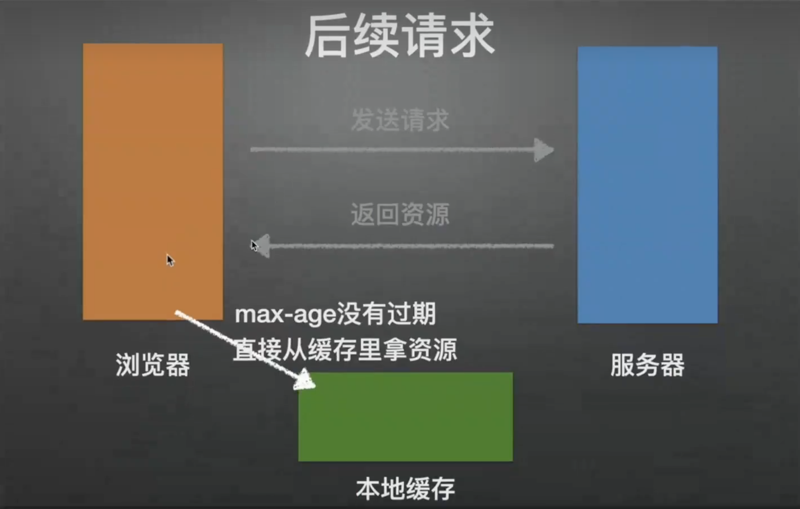

# 浏览器HTTP缓存

### 场景

在一个前端项目中，访问服务器获取数据都是很常见的事情，但是如果相同的数据被重复请求了不止一次，那么多余的请求次数必然会浪费网络带宽，以及延迟浏览器渲染所要处理的内容，从而影响用户的使用体验。

如果用户使用的是按量计费的方式访问网络，那么多余的请求还会隐性地增加用户的网络流量资费。因此考虑使用缓存技术对已获取的资源进行重用，是一种提升网站性能与用户体验的有效策略。

### 定义

http缓存指的是:当客户端向服务器请求资源时，会先抵达浏览器缓存，如果浏览器有“要请求资源”的副本，就可以直接从浏览器缓存中提取而不是从原始服务器中提取这个资源。

http缓存都是从第二次请求开始的。

### ~~**缓存的原理**~~

~~在首次请求后保存一份请求资源的响应副本，当用户再次发起相同请求后，如果判断缓存命中则拦截请求，将之前存储的响应副本返回给用户，从而避免重新向服务器发起资源请求。~~

### 缓存的种类

缓存的技术种类有很多，比如代理缓存、浏览器缓存、网关缓存、负载均衡器及内容分发网络等~~，它们大致可以分为两类：共享缓存和私有缓存。~~

~~共享缓存指的是缓存内容可被多个用户使用，如公司内部架设的Web代理；私有缓存指的是只能单独被用户使用的缓存，如浏览器缓存。~~

**浏览器HTTP 缓存应该算是前端开发中最常接触的缓存机制之一，它又可细分为强制缓存与协商缓存**。

二者最大的区别在于判断缓存命中时，浏览器是否需要向服务器端进行询问以协商缓存的相关信息，进而判断是否需要就响应内容进行重新请求。

**强缓存命中的话不会发请求到服务器（比如chrome中的200 from memory cache），协商缓存一定会发请求到服务器**，通过资源的请求首部字段验证资源是否命中协商缓存，如果协商缓存命中，服务器会将这个请求返回，但是不会返回这个资源的实体，而是通知客户端可以从缓存中加载这个资源（304 not modified）

### 流程

第一次请求资源时，服务器返回资源，并在**response header**头中回传资源的缓存参数;

第二次请求时，浏览器判断这这些请求参数，命中**强缓存**就返回**200**，否则就把请求参数加到**request header**头中传给服务器，看是否命中**协商缓存**，命中则返回**304**，否则服务器会返回新的资源。

简要的流程图如下：

.png>)

### 强制缓存

对于强制缓存而言，如果浏览器判断所请求的目标资源有效命中，则可直接从强制缓存中返回请求响应，无须与服务器进行任何通信。

 (1).png>)

浏览器在第一次向服务器发送请求时，若服务器觉得该资源需要缓存，这是服务器就会在响应头response-header里面添加一个cache-control，如设置max-age，这样浏览器就会在本地缓存中存下相相应的文件。

在浏览器下一次请求同样的文件时，浏览器就会去检查**max-age**有没有过期，如果没有过期就直接从本地缓存里获取资源，不会向服务器去发请求，这样就就会提升页面的加载速度。如果**max-age**过期了，那么浏览器又会向第一次一样去向浏览器发送请求。

在介绍强制缓存命中判断之前，我们首先来看一段响应头的部分信息

 (1).png>)

其中与强制缓存相关的两个字段是 **expires** 和 **cache-control**，让我们先了解一下expires

### expires

&#x20;expires 是在HTTP 1.0 协议中声明的用来控制缓存失效日期时间戳的字段，它由服务器端指定后通过响应头告知浏览器，浏览器在接收到带有该字段的响应体后进行缓存。

若之后浏览器再次发起相同的资源请求，便会对比 expires 与本地当前的时间戳，如果当前请求的本地时间戳小于 expires 的值，则说明浏览器缓存的响应还未过期，可以直接使用而无须向服务器端再次发起请求。只有当本地时间戳大于 expires 值发生缓存过期时，才允许重新向服务器发起请求。

### 小结

从上述强制缓存是否过期的判断机制中不难看出，这个方式存在一个很大的漏洞，即对本地时间戳过分依赖，如果客户端本地的时间与服务器端的时间不同步，或者对客户端时间进行主动修改，那么对于缓存过期的判断可能就无法和预期相符。

另一个与强缓存相关的字段是cache-control，让我们再来了解一下它

### cache-control

为了解决 **expires**判断的局限性，从HTTP 1.1协议开始新增了**cache-control**字段来对expires的功能进行扩展和完善。

从上述代码中可见cache-control设置了 maxage=31536000的属性值来控制响应资源的有效期，它是一个以秒为单位的时间长度，表示该资源在被请求到后的31536000秒内有效，如此便可避免服务器端和客户端时间戳不同步而造成的问题。

除此之外， cache-control 还可配置一些其他属性值来更准确地控制缓存，下面来具体介绍。

 (1).png>)

这种方式页面的加载速度是最快的，性能也是很好的，但是在这期间，如果服务器端的资源修改了，页面上是拿不到的，因为它不会再向服务器发请求了。这种情况就是我们在开发种经常遇到的，比如你修改了页面上的某个样式，在页面上刷新了但没有生效，因为走的是强缓存，所以Ctrl+F5之后就好了。&#x20;

~~from memory cache代表使用内存中的缓在存，from disk cache则代表使用的是硬盘中的的缓存，浏览器读取缓存的顺序为memory->disk。在浏览器中，浏贤览器会在js和图片等文件解析执行后直接存入内存缓存中，那么当刷新页面时只需直接从内存缓存中读取(fromm emorycache);而css文件则会存入硬盘文件中，所以每次渲染页面都需要从硬盘读取缓存(from diskcache)。~~

cache-control的几个属性

 (1).png>)

###

### no-cache和no-store

设置no-cache并非像字面上的意思不使用缓存，其表示为强制进行协商缓存(后面会说)，即对于每次发起的请求都不会再去判断强制缓存是否过期，而是直接与服务器协商来验证缓存的有效性，若缓存未过期，则会使用本地缓存。

设置no-store则表示禁止使用任何缓存策略，客户端的每次请求都需要服务器端给予全新的响应。

no-cache和no-store是两个互斥的属性值，不能同时设置。

### private和public

private和public也是cache-control的一组互斥属性值，它们用以明确响应资源是否可被代理服务器进行缓存。

若资源响应头中的cache-control字段设置了 public属性值，则表示响应资源既可以被浏览器缓存，又可以被代理服务器缓存。 private 则限制了响应资源只能被浏览器缓存，若未显式指定则默认值为private

~~对于应用程序中不会改变的文件，你通常可以在发送响应头前添加积极缓存。这包括例如由应用程序提供的静态文件，例如图像， CSS文件和JavaScript文件。~~

~~例如：Cache-Control:public，max-age=31~~

### max-age和s-maxage

max-age属性值会比 s-maxage更常用，它表示服务器端告知客户端浏览器响应资源的过期时长。在一般项目的使用场景中基本够用，对于大型架构的项目通常会涉及使用各种代理服务器的情况，这就需要考虑缓存在代理服务器上的有效性问题。这便是s- maxage存在的意义，它表示缓存在代理服务器中的过期时长，且仅当设置了public属性值时才有效。

### 总结

优先级： cache-control 大于 expires

cache-control能作为 expires的完全替代方案，并且拥有其所不具备的一些缓存控制特性，在项目实践中使用它就足够了。

目前 expires还存在的唯一理由是考虑可用性方面的向下兼容。

## 协商缓存

协商缓存就是强制缓存失效后，浏览器携带缓存标识向服务器发起请求，由服务器根据缓存标识决定是否使用缓存的过程

通常是采用所请求资源最近一次的修改时间戳来判断的，为了便于理解，下面来看一个例子:假设客户端浏览器需要向服务器请求一个manifest.js的JavaScript文件资源，为了让该资源被再次请求时能通过协商缓存的机制使用本地缓存，那么首次返回该图片资源的响应头中应当包含一个名为last-modified 的字段，该字段的属性值为该 JavaScript文件最近一次修改的时间戳，简略截取请求头与响应头的关键信息如下:

当我们刷新网页时，由于该JavaScript文件使用的是协商缓存，客户端浏览器无法确定本地缓存是否过期，所以需要向服务器发送一次GET请求，进行缓存有效性的协商，此次GET请求的请求头中需要包含一个 if-modified-since字段，其值正是上次响应头中last-modified的字段值。

当服务器收到该请求后便会对比请求资源当前的修改时间戳与if-modified-since字段的值，如果二者相同则说明缓存未过期，可继续使用本地缓存，否则服务器重新返回全新的文件资源，简略截取请求头与响应头的关键信息如下:

这里需要注意的是，协商缓存判断缓存有效的响应状态码是304，即缓存有效响应重定向到本地缓存上。这和强制缓存有所不同，强制缓存若有效，则再次请求的响应状态码是200。

.png>)

浏览器第一次请求的时候，若服务器使用了协商缓存学的策略，则它会返回资源和资源标识，并且浏览器将返回的资源存储到本地缓存。

 (1).png>)

当浏览器再次请求该资源时，浏览器向服务器发送请求和资源标识，服务器这时就会去判断当前请求的资源浏览器本次缓存的版本跟服务器里面资源最新的版本是否一致:

* 如果版本一致，服务器返回304状态码，重定向让浏览器直接在本地缓存里拿资源; ·
* 如果版本不一致，服务器返回200状态码、最新的资源以及新的资源标识，浏览器更新本地缓存。&#x20;

资源标识:&#x20;

* Last-Modified/lf-Modified-Since:指资源上一次修改的时间&#x20;
* Etag/If-None-Match:资源对应的唯一字符串&#x20;

服务器会为每个资源生成一个唯一的标识字符串，只要文件内容不同，它们对应的Etag就是不同的;

If-Modified Since能检查到的精度是秒级的，某些服务器不能精确的得到文件的最后修改时间，我们编辑了文件，但文件的内容没有改变。因为服务器是根据文件的最后修改时间来判断的，导致重新请求所以才出现了Etag，Etag对服务器也有性能损耗Last-Modified与ETag是可以一起使用的，服务器会优先验证ETag，一致的情况下，才会继续比对 Last-Modified，最后才决定是否返回304

###

### last-modifed

 (1).png>)

在浏览器第一次请求时，服务器返回资源和资源标识符Last-Modified(在响应头中)

 (1).png>)

在后续请求中，浏览器就会在请求头带上资源标识If- Modified-Since发起请求，If-Modified-Since的值就是上一次请求时返回的Last-Modified的值，这时在服务器就会去对比IfModified-Since和Last-Modified的值判断是否是最新资源。

### Last-Modified 小结

通过last-modified所实现的协商缓存能够满足大部分的使用场景，但也存在两个比较明显的缺陷:

首先它只是根据资源最后的修改时间戳进行判断的，虽然请求的文件资源进行了编辑，但内容并没有发生任何变化，时间戳也会更新，从而导致协商缓存时关于有效性的判断验证为失效，需要重新进行完整的资源请求。这无疑会造成网络带宽资源的浪费，以及延长用户获取到目标资源的时间。 。其次标识文件资源修改的时间戳单位是秒，如果文件修改的速度非常快，假设在几百毫秒内完成，那么上述通过时间戳的方式来验证缓存的有效性，是无法识别出该次文件资源的更新的

其实造成上述两种缺陷的原因相同，就是服务器无法仅依据资源修改的时间戳来识别出真正的更新，进而导致重新发起了请求，该重新请求却使用了缓存的Bug场景。

### ETag

.png>)

 (1).png>)

为了弥补通过时间戳判断的不足，从HTTP 1.1规范开始新增了一个ETag的头信息，即实体标签(EntityTag)。

其内容主要是服务器为不同资源进行哈希运算所生成的一个字符串，该字符串类似于文件指纹，只要文件内容编码存在差异，对应的ETag标签值就会不同，因此可以使用 ETag对文件资源进行更精准的变化感知。下面我们来看一个使用ETag进行协商缓存图片资源的示例，首次请求后的部分响应头

.png>)

### ETag小结

不像强制缓存中cache-control可以完全替代expires的功能，在协商缓存中， ETag并非last-modified的替代方案而是一种补充方案，因为它依旧存在一些憋端。

一方面服务器对于生成文件资源的ETag需要付出额外的计算开销，如果资源的尺寸较大，数量较多且修改比较频繁，那么生成ETag的过程就会影响服务器的性能。

另一方面 ETag字段值的生成分为强验证和弱验证，强验证根据资源内容进行生成，能够保证每个字节都相同;弱验证则根据资源的部分属性值来生成，生成速度快但无法确保每个字节都相同，并且在服务器集群场景下，也会因为不够准确而降低协商缓存有效性验证的成功率，所以恰当的方式是根据具体的资源使用场景选择恰当的缓存校验方式。

### 对比强缓存和协商缓存

.png>)

## 缓存决策

前面我们较为详细地介绍了浏览器 HTTP缓在字的配置与验证细节，下面思考一下如何应用 HTTP缓存技术来提升网站的性能。假设在不考虑客户端缓存容量与服务器算力的理想情况下，我们当然希望客户端浏览器上的缓存触发发率尽可能高，留存时间尽可能长，同时还要 ETag 实现当资源更新时进行高效的重新验证

但实际情况往往是容量与算力都有限，因此就就需要制定合适的缓存策略，来利用有限的资源达到最优的性能效果。明确能力的边界，力习我在边界内做到最好。

## 缓存决策树

&#x20;在面对一个具体的缓存需求日 时，到底该如何制定缓存策略呢? 我们可以参照图所示的决策树 来逐步确定对一个资源具体白的缓存策略。

 (1).png>)

如果希望使用缓存，那么接下来就需要确定对缓存有效性的判断是否要与服务器进行协商，若需要与服务器协商则可为cache-control字段增加no-cache属性值，来强制启用协商缓存。

否则接下来考虑是否允许中间代理服务器缓存该资源，参考之前在强制缓存中介绍的内容可通过为cache-control字段添加private或public来进行控制。如果之前未设置 no-cache启用协商缓存，那么接下来可设置强制缓存的过期时间，即为cache-control字段配置max-age=…的属性值，最后如果启用了协商缓存，则可进一步设置请求资源的 last-modified 和ETag实体标签等参数。

这里建议你能够根据该决策树的流程去设置缓存策略，这样不但会让指定的策略有很高的可 行性，而且对于理解缓存过程中的各个知识点也非常有帮助。

